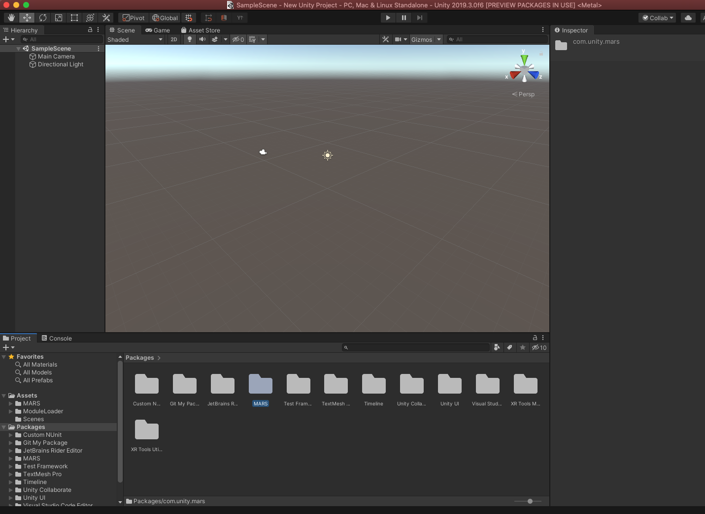
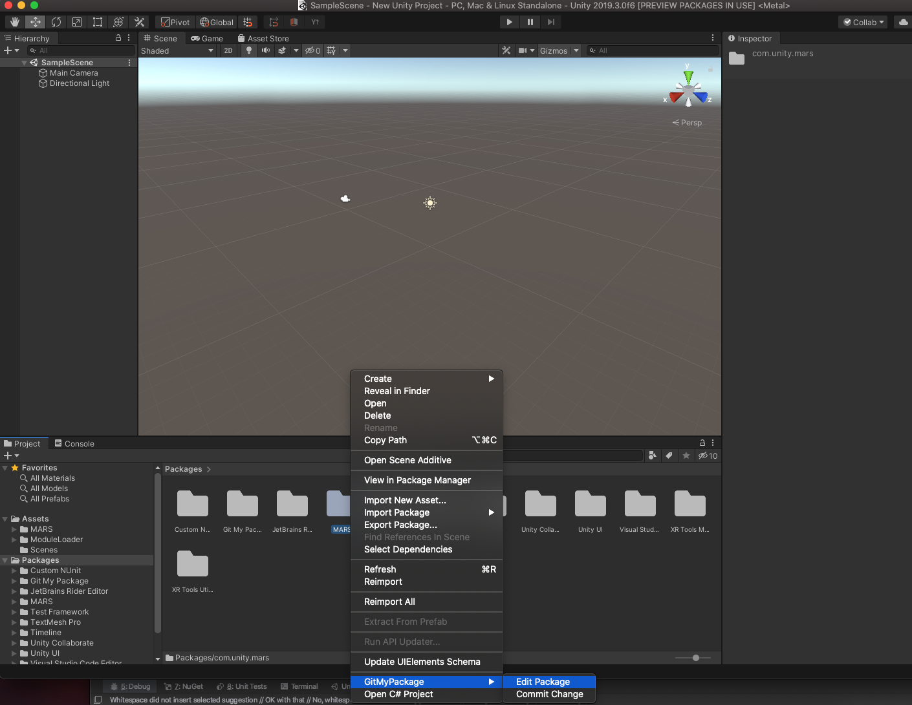
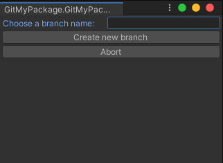
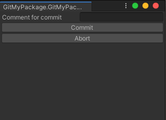

# git-my-package

This package adds functionality to the Unity Editor to enable the ability to edit packages installed by the Unity Package Manager (UPM).  By default, all packages installed by UPM are read-only and do not include the source's .git folder which makes development impossible.  This package will fetch to the source of a package at the published revision and embed it into your project.  This will enable developers to create new Unity projects with published packages and select which ones they would like to develop on.

# Usage

1. Create a new Unity project and use the Package Manager to install any packages you require.
1. Open the Editor's Project window and select the Project's *Packages* folder.  

1. Select the package you would like to edit and right-click on it in the right column of the Project window.

1. Select the *Edit Package* option.  This will read the published package's package.json and retrieve the revision for the published equivalent.  At this point, it will clone the package's repository locally in the same state as it was published.
1. Choose a branch name for your development.  This will create and push your branch to remote.

1. Make changes to your package.
1. Once you have a set of changes to commit, right-click on your package (as you did in step 3) and select the *Commit Change* option.  This will allow you to add a commit message and push your changes to remote.

# TODO list

1. Support commits to submodules
1. List changes so user can pick what to commit
1. Support checking out package dependencies
